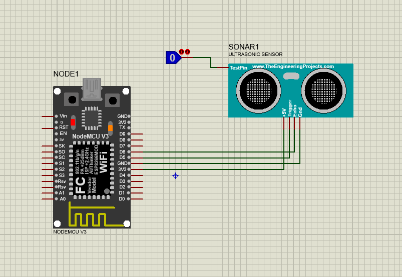

# Interfacing of Distance Sensor (ping) with ESP8266 NodeMCU
## Content

1. [Overview](#overview)
2. [Components Required](#components)
3. [Circuit Diagram](#circuit-diagram)
4. [Software Required](#software-required)
5. [Project Flow](#project-flow)

## Overview
This project interfaces an ultrasonic sensor with an ESP8266 (NodeMCU) to measure distance and upload the data to ThingSpeak.

## Components
- ESP8266 NodeMCU
- Ultrasonic Sensor
- Breadboard and jumper wires
- USB cable 

## Circuit Diagram
- Connect the ultrasonic sensor and ESP8266 as follows:
  - VCC -> 3.3V
  - GND -> GND
  - TRIG -> GPIO pin D5
  - ECHO -> GPIO pin D6
  - 

## Software Required
- [VS Code](https://code.visualstudio.com/)
- [PlatformIO](https://platformio.org/)
  - Create new project and select ESP8266 NodeMCU board
 - [ThingSpeak Account](https://thingspeak.com/)
      - Create new channel in thingspeak

## Libraries Requried
- ESP8266WiFi
- NewPing
- ThingSpeak

## Project Flow

### Serial Communication Setup:
- Serial.begin(115200): Initializes serial communication at a baud rate of 115200 for debugging purposes.

### WiFi Connection Setup:
- WiFi.begin(ssid, password): Attempts to connect to the specified WiFi network using the provided SSID and password.
- while (WiFi.status() != WL_CONNECTED) { ... }: Waits until the ESP8266 successfully connects to the WiFi network, printing dots (.) to indicate connection progress.

### Initialization
- Initialize ThingSpeak
- Initialize pins of ultrasonic sensor as INPUT or OUTPUT

### Main Loop:
- To read distance we have to create pulse by making trigPin low and then high for 10 milisecond.
- Calculate distance by muiltiplying duration with 0.034 (speed of sound) and dividing by 2.
- Print distance to serial monitor
- Write data to thingspeak account by providing channel number and API key.

## OUTPUT
-Link of thingSpeak channel data:
https://api.thingspeak.com/channels/2588939/feeds.json?api_key=50PXMKW9NJ4YOOEC&results=2

  

